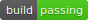

# Easy-DevOps App

[](https://jenkins.stensel.nl/job/easy-devops/)
[](https://snyk.io/test/github/Stensel8/easy-devops)
[](https://dotnet.microsoft.com/)
[](LICENSE)

A simple application for technical management and system monitoring. Built to demonstrate DevOps concepts and Jenkins basics. This is a school/test project, not for production use. Contributions welcome!

## Features

- Welcome message display
- Live clock updating every 10 seconds
- Real-time ping response times for multiple domains (Google, GitHub, Microsoft, Saxion, and custom domains)
- Educational tool for DevOps and Jenkins CI/CD basics

## Prerequisites

- .NET SDK 8.0+ ([Download](https://dotnet.microsoft.com/download))
- Git ([Download](https://git-scm.com))
- Jenkins (optional for CI/CD exploration)

## Installation & Running

### Auto Installation
Run the PowerShell script: `.\scripts\install.ps1`

### Manual Installation
```bash
git clone https://github.com/stensel8/easy-devops.git
cd easy-devops/frontend
dotnet build
dotnet run
```

## Docker/Podman/Kubernetes

Run the predefined image: `docker run -it stensel8/easy-devops:latest`

Use scripts in `scripts/` for building and running:
- `python devops.py build` - Build app
- `python devops.py dockerize` - Create Docker image
- `python devops.py run` - Run container
- `python devops.py all` - Full pipeline

Deploy to Kubernetes using configs in `kubernetes/`.

## Color Output in Docker

Docker may not show colors without `-it` flag. Use `docker run -it stensel8/easy-devops:latest` for colored output.
