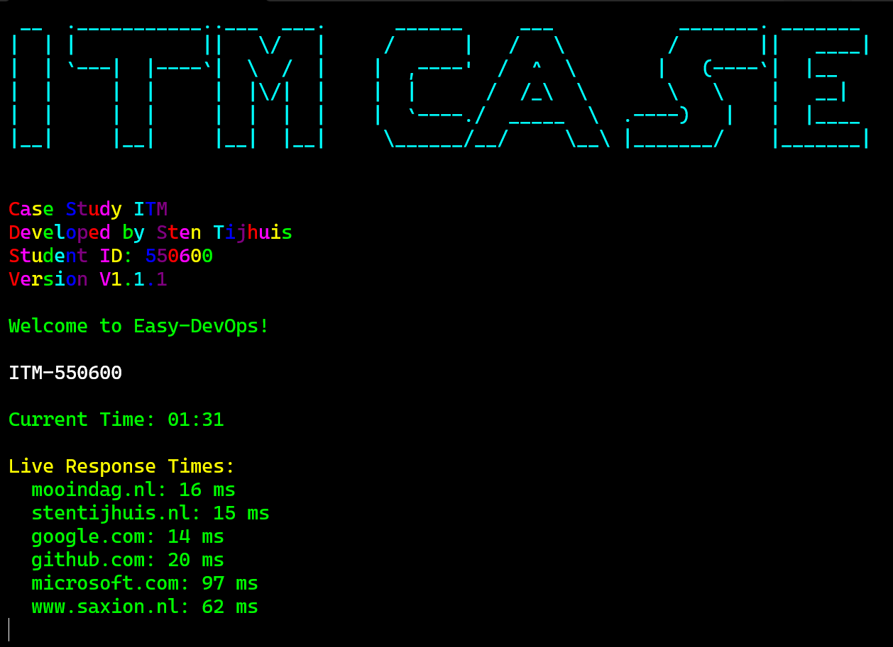
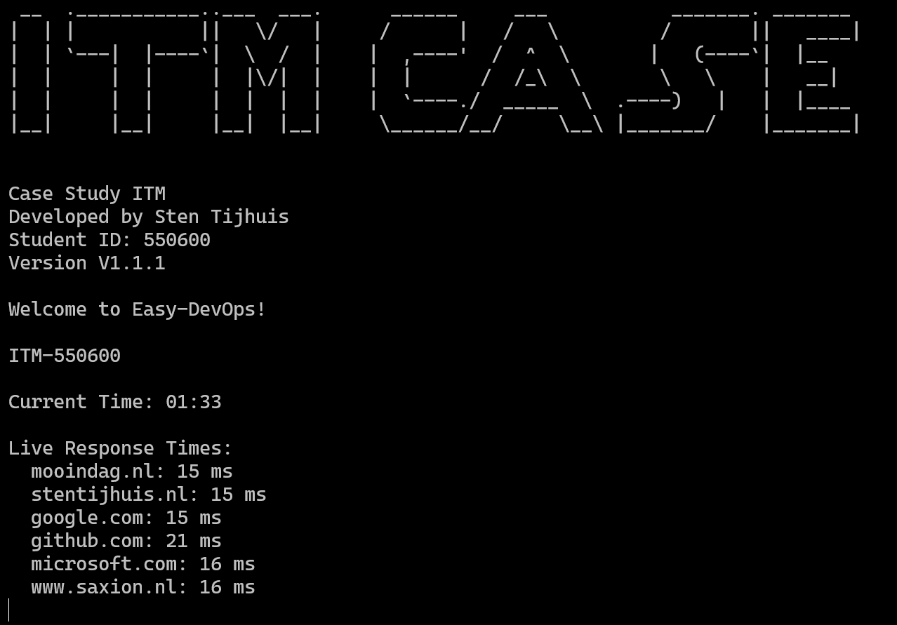

# Easy-DevOps App

A simple concept application for technical management and system monitoring. Built during my studies to explore and demonstrate DevOps concepts and Jenkins basics. This is a school/test project and should not be taken seriously. Contributions and feedback are welcome!

> **Note**: This application is not intended for production use. It serves as a demonstration and learning tool for DevOps practices and Jenkins pipeline basics.

---

## Features

- **Welcome Print**: Displays a welcome message (like "Hello, World!").
- **Live Clock**: Shows the current time, updated every 5 seconds.
- **Response Times**: Provides real-time ping response times for domains such as:
  - Google
  - GitHub
  - Microsoft
- **DevOps & Jenkins Basics**: Helps beginners learn CI/CD and understand Jenkins pipelines.
- **Educational Focus**: Ideal for introducing DevOps concepts to students.

---

## Getting Started

### Prerequisites

- **.NET SDK**: [Download .NET SDK](https://dotnet.microsoft.com/download) (version 8.0 or later is recommended).
- **Git**: Ensure Git is installed on your system. [Download Git](https://git-scm.com) if needed.
- **Jenkins (optional)**: For exploring CI/CD basics. [Learn more about Jenkins](https://www.jenkins.io/).

### Auto Installation
<<<<<<< Updated upstream
- For automatic deployment, you can run the pre-defined powershell-file:
   ```bash
   .\scripts\install.ps1
---
=======

For automatic deployment, run the pre-defined PowerShell file:

    .\scripts\install.ps1
>>>>>>> Stashed changes

### Manual Installation

1. Clone the repository:

       git clone https://github.com/stensel8/easy-devops.git

2. Navigate to the project directory:

       cd easy-devops/frontend

3. Build the application:

       dotnet build

4. Run the application:

       dotnet run

---

## Docker/Kubernetes Containerization (New/Beta)

This app can be built and packaged as a container for use with Docker and Kubernetes.

<<<<<<< Updated upstream
# Run the predefined image:
   ```bash
docker run stensel8student/easy-devops:latest
   ```

Alternatively, you can build one yourself...

**To get started:**
=======
### [Running the Predefined Image](https://hub.docker.com/r/stensel8/easy-devops)
>>>>>>> Stashed changes

    docker run stensel8/easy-devops:latest
    
> **Note**: Running without the `-it` flag may result in no color output. For colored output, use:

    docker run -it stensel8/easy-devops:latest

### Building and Running Locally via Scripts

1. Navigate to the scripts folder:

       cd scripts

2. Choose an action:
   - Build the application:

         python devops.py build
   
   - Build the application (EXE for Windows):

         python devops.py build-exe


   - Create the Docker image:

         python devops.py dockerize

   - Run the container:

         python devops.py run

   - Run all steps (build, dockerize, and run):

         python devops.py all

### Deploying to Kubernetes (Optional)

Refer to the **kubernetes/** folder for deployment configurations (e.g., `deployment.yaml`) to deploy the app on a Kubernetes cluster.

---

## Why Does the App Lose Color in Docker?





By default, Docker does not allocate an interactive terminal unless you specify the `-it` flags.

- When you run the container with:

      docker run stensel8/easy-devops:latest

  Docker does not create a pseudo-TTY, so color codes may not be displayed.

- To see the colored ASCII art and text, run:

      docker run -it stensel8/easy-devops:latest

  The `-it` flag allocates a pseudo-TTY and keeps stdin open, enabling ANSI color codes.

Locally, running the app with:

      dotnet run

always shows color, as your terminal supports ANSI color by default.

___
